<div align="center">

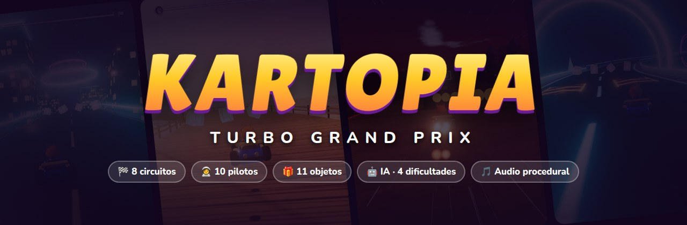

# 🏎️ Kartopia · Turbo Grand Prix

**Un juego de carreras de karts en 3D que se juega en el navegador.**<br>
Derrapes, mini-turbos, objetos, 8 circuitos, IA rival y Gran Premio. Sin instalar nada.

<a href="https://kartopia.jorgesanchezvillanuevaa.workers.dev"></a>

**👉 [kartopia.jorgesanchezvillanuevaa.workers.dev](https://kartopia.jorgesanchezvillanuevaa.workers.dev) 👈**<br>
<sub>Ábrelo en el navegador del ordenador y a correr. Se juega con teclado o mando.</sub>


[🚀 Jugar online](https://kartopia.jorgesanchezvillanuevaa.workers.dev) ·
[🎮 Controles](#-controles) ·
[🗺️ Circuitos](#️-circuitos) ·
[🎁 Objetos](#-objetos) ·
[🧑‍🚀 Pilotos y karts](#-pilotos-y-karts) ·
[🛠️ Para desarrolladores](#️-para-desarrolladores)

</div>

---

## ✨ Qué tiene

<table>
<tr>
<td width="50%" valign="top">

### 🏁 Carreras
- **8 circuitos** con saltos, atajos, obstáculos y rutas elevadas
- **Gran Premio** con 3 copas, puntos, podio y trofeos
- **Carrera individual** con dificultad, vueltas, rivales y objetos a tu gusto
- **Contrarreloj** contra el fantasma de tu mejor vuelta
- **4 dificultades**: 50cc, 100cc, 150cc y 200cc

</td>
<td width="50%" valign="top">

### 🕹️ Conducción arcade
- **Derrape** con 3 niveles de mini-turbo (🔵 → 🟠 → 🟣)
- **Salida turbo** si aceleras en el momento justo
- **Trucos** en las rampas que se convierten en turbo al aterrizar
- **Control aéreo**, pendientes, peraltes, hielo, barro y arena
- **Rescate** automático si te caes al vacío, al agua o a la lava

</td>
</tr>
<tr>
<td width="50%" valign="top">

### 🤖 Rivales con IA
- Siguen una línea de carrera, frenan en las curvas y derrapan
- Adelantan, esquivan trampas y obstáculos, y se recuperan si chocan
- Usan los objetos con cabeza y cometen errores según la dificultad

</td>
<td width="50%" valign="top">

### 🎨 Todo generado por código
- Modelos, texturas, cielo, agua y lava creados en tiempo real
- Música y efectos de sonido sintetizados con Web Audio
- Sin archivos con derechos de autor: todo es original
- Tu progreso y tus opciones se guardan solos en el navegador

</td>
</tr>
</table>

---

## 🚀 Cómo jugar

### 🌐 Online

**Juega directamente aquí: <https://kartopia.jorgesanchezvillanuevaa.workers.dev>**

Solo necesitas un navegador actual en el ordenador (Chrome, Edge, Firefox o Safari 16 o
posterior) con **WebGL 2**. Se juega con teclado o con mando.

### 💻 En tu ordenador

No hay que compilar ni instalar dependencias. Solo hace falta **servir la carpeta con un servidor
local**. Si abres `index.html` con doble clic no funciona, porque el navegador bloquea los módulos.

```bash
git clone https://github.com/jrxvex/mariocart.git
cd mariocart

python -m http.server 8080        # con Python 3
# o bien
npx serve -l 8080 .               # con Node.js
```

Después abre **<http://localhost:8080>** en Chrome, Edge, Firefox o Safari 16 o posterior. Hace
falta que el navegador tenga **WebGL 2**.

> 💡 Si va lento en tu ordenador, entra en **Opciones → Gráficos** y baja la calidad.

---

## 🎮 Controles

| Acción | ⌨️ Teclado | 🎮 Mando |
| :-- | :--: | :--: |
| Acelerar | `W` / `↑` | A · gatillo derecho |
| Frenar / marcha atrás | `S` / `↓` | B · gatillo izquierdo |
| Girar | `A` `D` / `←` `→` | Stick izquierdo · cruceta |
| Derrape / salto | `Espacio` | RB · X |
| Usar objeto | `Shift` | LB · Y |
| Mirar atrás | `C` | — |
| Rescate manual | `R` | Select |
| Pausa | `Esc` / `P` | Start |

Todos los botones se pueden cambiar en **Opciones → Controles**. Los menús funcionan con teclado,
ratón o mando.

<details>
<summary><b>🏆 Trucos para ganar</b></summary>

<br>

- **Salida turbo:** empieza a mantener acelerar en la segunda mitad del «2» de la cuenta atrás.
  Si aceleras demasiado pronto, el motor se ahoga.
- **Mini-turbo:** mantén el derrape en la curva. Cuanto más dure, más potente es el impulso al
  soltarlo: chispas azules, luego naranjas y por último moradas.
- **Trucos:** pulsa derrape justo al despegar de una rampa y aterrizarás con un turbo.
- **Defensa:** mantén el botón de objeto para llevar una trampa u orbe detrás como escudo.
- **Disparar hacia atrás:** mantén frenar mientras usas el objeto.
- **Atajos:** el barro, la arena y los callejones te frenan, pero con un turbo acortan mucho.

</details>

---

## 🗺️ Circuitos

<table>
<tr>
<td width="50%">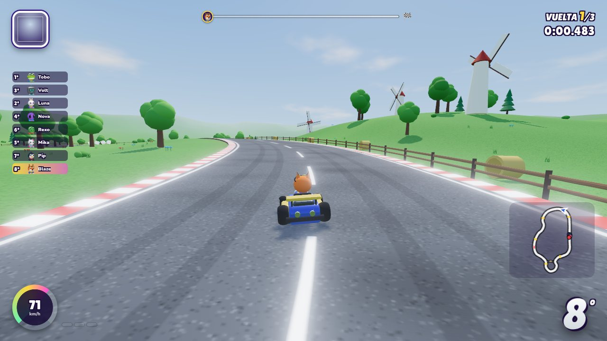</td>
<td width="50%">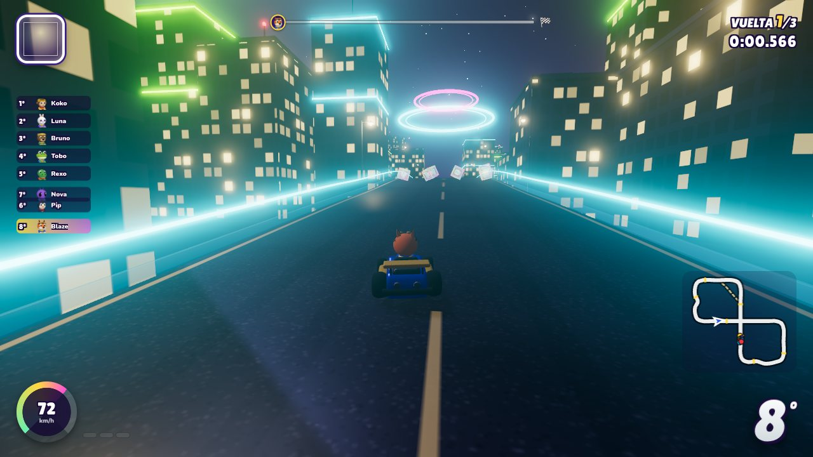</td>
</tr>
<tr>
<td><b>🌿 Valle Verde</b> ★☆☆<br><sub>Colinas, molinos, puente de madera, salto sobre el río y atajo embarrado junto al lago.</sub></td>
<td><b>🌃 Ciudad Neón</b> ★★☆<br><sub>Un ocho nocturno con paso elevado, tráfico, chicane y un callejón en obras.</sub></td>
</tr>
<tr>
<td>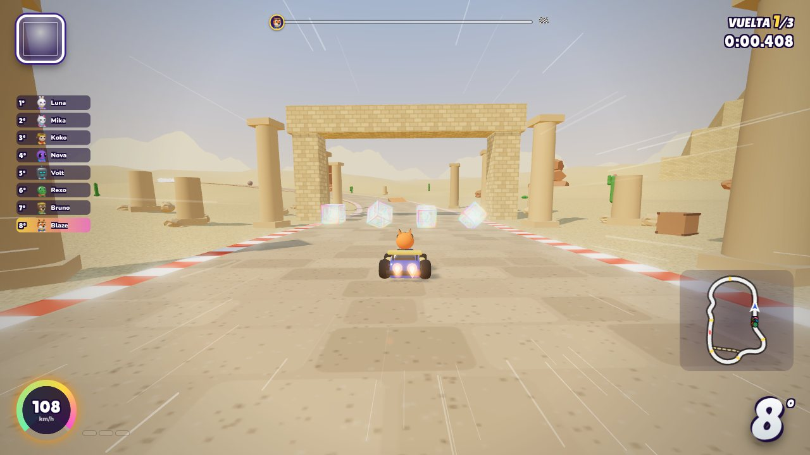</td>
<td>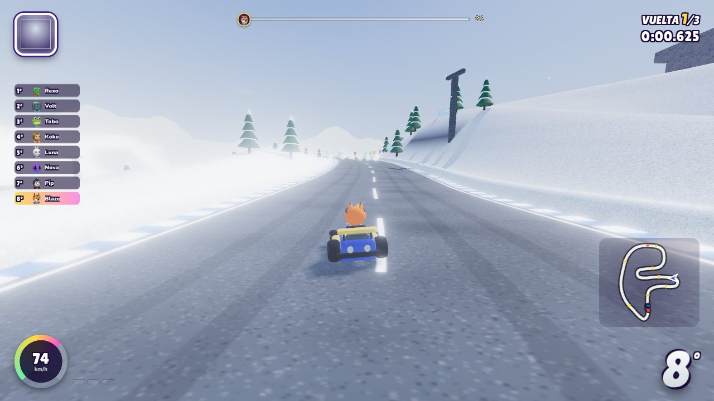</td>
</tr>
<tr>
<td><b>🏜️ Ruinas del Desierto</b> ★★☆<br><sub>Avenida de columnas, cañón de roca, salto sobre un río, oasis y túnel del templo.</sub></td>
<td><b>🏔️ Montaña Celeste</b> ★★★<br><sub>Curvas de herradura, galería en la cumbre, salto en la cresta y hielo junto al precipicio.</sub></td>
</tr>
<tr>
<td>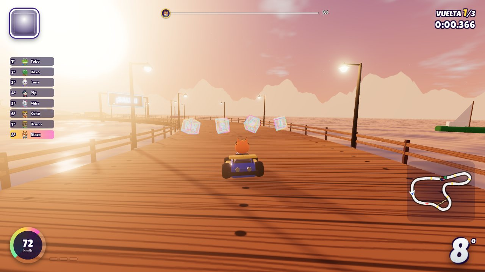</td>
<td>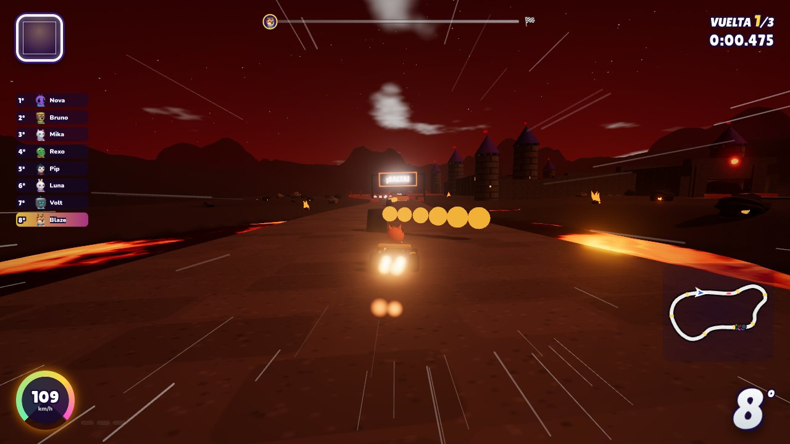</td>
</tr>
<tr>
<td><b>🏖️ Resort Oceánico</b> ★★☆<br><sub>Paseo al atardecer, muelle con salto a la isla del faro, cangrejos y barcos.</sub></td>
<td><b>🌋 Castillo de Lava</b> ★★★<br><sub>Puentes sin barandilla sobre lava, barras de fuego, un volcán y apisonadoras.</sub></td>
</tr>
<tr>
<td>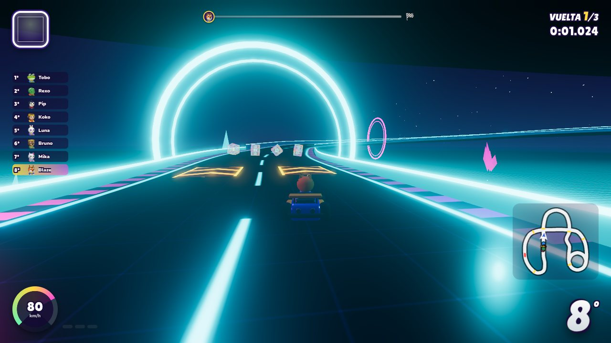</td>
<td>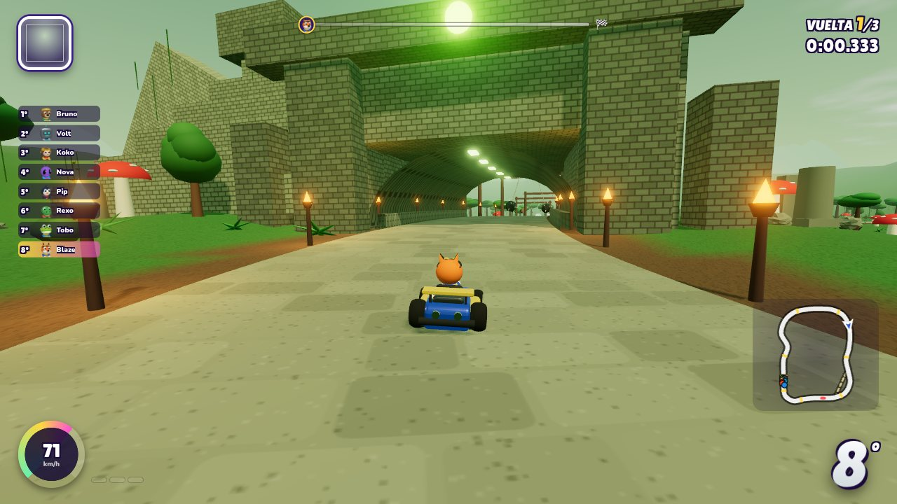</td>
</tr>
<tr>
<td><b>💠 Circuito Cibernético</b> ★★★<br><sub>Pista de neón flotando en el vacío, peraltes extremos, una hélice y cubos de datos.</sub></td>
<td><b>🛕 Templo del Bosque</b> ★★★<br><sub>Puente colgante, pasadizo del templo, péndulos, un tronco hueco y una cascada.</sub></td>
</tr>
</table>

### 🏆 Copas del Gran Premio

| Copa | Circuitos |
| :-- | :-- |
| 🍃 **Copa Hoja** | Valle Verde · Ruinas del Desierto · Resort Oceánico · Templo del Bosque |
| ⚡ **Copa Rayo** | Ciudad Neón · Montaña Celeste · Castillo de Lava · Circuito Cibernético |
| 👑 **Copa Suprema** | Los 8 circuitos seguidos |

Puntos por carrera: **15 · 12 · 10 · 8 · 6 · 4 · 2 · 1**

---

## 🎁 Objetos

| | Objeto | Qué hace |
| :--: | :-- | :-- |
| 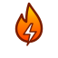 | **Turbo** | Impulso instantáneo, incluso fuera de pista |
| 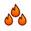 | **Triple Turbo** | Tres turbos seguidos |
| 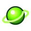 | **Orbe Pulso** | Va en línea recta y rebota en los muros; también hacia atrás |
|  | **Orbe Rastreador** | Persigue al rival que tienes justo delante |
| 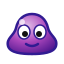 | **Trampa Pegajosa** | Hace trompear a quien la pise; puedes llevarla detrás de escudo |
|  | **Burbuja Escudo** | Aguanta un impacto durante 10 segundos |
| 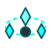 | **Guardia Orbital** | Tres cristales giran a tu alrededor y se pueden disparar |
|  | **Onda Helada** | Congela a todos los que van por delante |
| 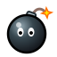 | **Bomba Estallido** | Se lanza en parábola y explota en un radio amplio |
|  | **Cometa Veloz** | Piloto automático a toda velocidad que arrolla a los rivales |
|  | **Aura Prisma** | Invencible y más rápido durante unos segundos |

> 🎲 Lo que sale de las cajas depende de tu posición: cuanto más atrás vas, mejores objetos te tocan.

---

## 🧑‍🚀 Pilotos y karts

| Piloto | Peso | Estilo |
| :-- | :--: | :-- |
| 🦊 **Blaze** | Medio | Equilibrado y fiable |
| 🐧 **Pip** | Ligero | Gran aceleración y mini-turbos |
| 🐻 **Bruno** | Pesado | Difícil de empujar, gran velocidad punta |
| 🐱 **Mika** | Ligero | El mejor manejo del paddock |
| 🦖 **Rexo** | Pesado | Máxima velocidad y peso, poca aceleración |
| 🐰 **Luna** | Ligero | Gran agarre en cualquier superficie |
| 🐸 **Tobo** | Medio | Brilla fuera de la pista |
| 🤖 **Volt** | Pesado | Calibrado para la velocidad pura |
| 👽 **Nova** | Medio | Aceleración y derrapes cósmicos |
| 🐵 **Koko** | Ligero | Rapidísimo en las curvas cerradas |

**Karts:** Estándar · Bala · Buggy · Titán · Pluma · Retro · Cometa · Bañera. Cada uno cambia la
velocidad, la aceleración, el manejo, el peso y el agarre fuera de pista.

---

## 📸 Menús

<table>
<tr>
<td width="50%">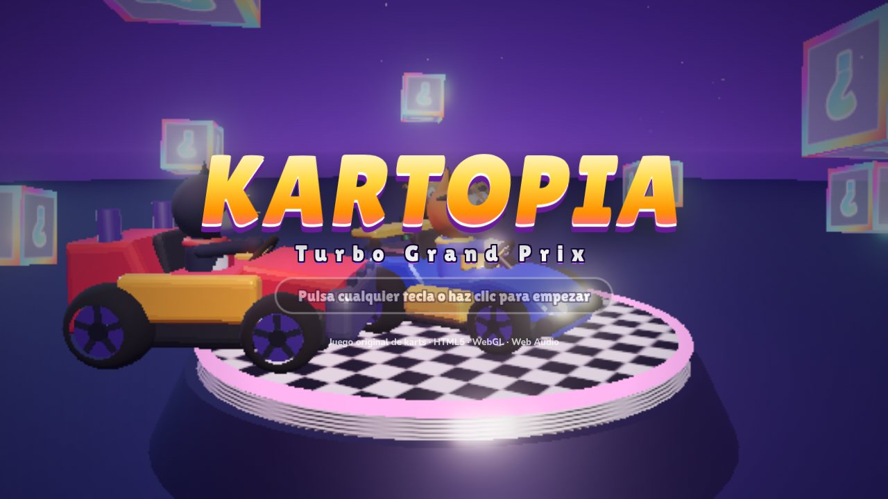</td>
<td width="50%">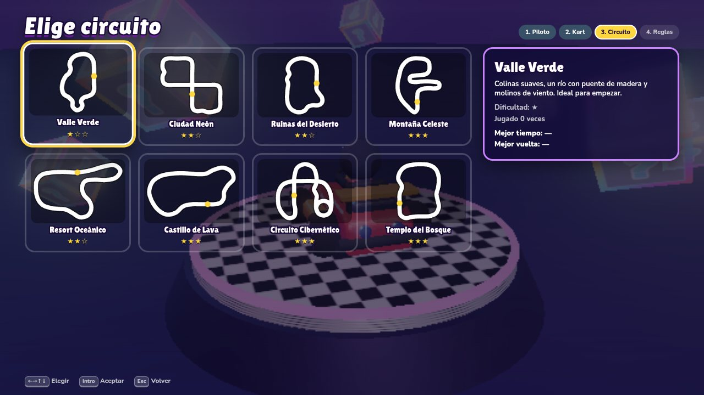</td>
</tr>
</table>

---

## 🛠️ Para desarrolladores

### 📁 Estructura

```
📦 mariocart
├── index.html          → página única: lienzos, interfaz y mapa de importación
├── css/                → estilos de la carga, los menús y el HUD
├── data/               → JSON: pilotos, karts, objetos, dificultades, circuitos y música
├── assets/             → fuentes (OFL), iconos de objetos y favicon
├── vendor/three/       → Three.js r186 (MIT) con el postprocesado
├── js/
│   ├── main.js         → arranque
│   ├── config.js       → física, calidad gráfica, controles y puntos
│   ├── core/           → Game, bucle de paso fijo, eventos, guardado y datos
│   ├── input/          → teclado, mando y reasignación de teclas
│   ├── physics/        → superficies, colisiones y física del kart
│   ├── track/          → trazado, terreno, línea de carrera, obstáculos y render
│   ├── tracks/         → un archivo por circuito
│   ├── race/           → Kart, jugador, IA, RaceManager y fantasma
│   ├── items/          → sistema de objetos y un archivo por objeto
│   ├── render/         → renderizador, cielo, materiales, partículas y cámara
│   ├── models/         → karts, pilotos, decoración y objetos procedurales
│   ├── audio/          → sintetizador, música, efectos y motores
│   └── ui/             → menús, HUD y minimapa
├── tools/              → simulador de carreras y analizador de circuitos (Node)
└── docs/               → imágenes de este README
```

<details>
<summary><b>🧩 Clases principales</b></summary>

<br>

| Clase | Archivo | Se encarga de |
| :-- | :-- | :-- |
| `Game` | `js/core/Game.js` | Estados del juego, Gran Premio, carreras y guardado |
| `RaceManager` | `js/race/RaceManager.js` | Cuenta atrás, vueltas, checkpoints, posiciones y resultados |
| `Kart` · `PlayerController` · `AIController` | `js/race/` | El kart y quién lo conduce |
| `KartPhysics` | `js/physics/KartPhysics.js` | Aceleración, derrapes, saltos, rampas, muros, choques y rescate |
| `Track` · `buildTrack` | `js/track/` | Trazado, colisión, terreno y progreso |
| `ItemSystem` · `Item` | `js/items/` | Reparto, uso y comportamiento de los objetos |
| `CameraController` · `ParticleManager` · `RaceView` | `js/render/` | Cámara, efectos y escena |
| `AudioManager` | `js/audio/` | Música, motores y efectos |
| `UIManager` · `HUD` | `js/ui/` | Menús y datos de carrera en pantalla |

</details>

<details>
<summary><b>➕ Cómo añadir contenido</b></summary>

<br>

**Un circuito:** crea `js/tracks/miCircuito.js` con los puntos de control `[x, y, z, {w, bank}]`,
las secciones (muros, puentes, túneles, superficies), rampas, huecos, paneles turbo, cajas,
atajos, terreno, tema visual y obstáculos. La decoración va en `props(api)` y los monumentos en
`landmarks(kit)`. Luego regístralo en `data/tracks.json`. Los 8 circuitos incluidos sirven de
ejemplo.

**Un objeto:** crea una clase en `js/items/types/` que herede de `Item`, regístrala en
`js/items/ItemRegistry.js` con su lógica para la IA y añádela a `data/items.json` con sus
probabilidades por posición.

**Un piloto o un kart:** añade una entrada en `data/characters.json` o `data/karts.json`.

</details>

<details>
<summary><b>🧪 Herramientas de prueba</b></summary>

<br>

Necesitan Node.js 20.6 o posterior y se ejecutan desde la raíz del proyecto:

```bash
# Carreras completas de 8 karts con IA, sin gráficos
node --import ./tools/register.mjs tools/simulate.mjs all normal 3

# Revisa curvas, pendientes, cruces, saltos y atajos, y dibuja mapas SVG
node --import ./tools/register.mjs tools/trackcheck.mjs all mapas/
```

Parámetros de URL para probar rápido:

```
?quick=neon-city&difficulty=hard&laps=1&skipIntro&autopilot&timescale=2
```

</details>

---

## 🖥️ Rendimiento y pantallas

- **Calidad gráfica** baja, media, alta o ultra. Cambia la resolución interna, las sombras, el
  resplandor, las partículas, la vegetación y las luces.
- Además se pueden ajustar por separado las sombras, el resplandor (bloom), la escala de
  resolución, las líneas de velocidad y el contador de FPS.
- Se adapta a **1366×768, 1920×1080, 2560×1440** y a pantallas **ultrapanorámicas**.

---

## 📜 Licencias

| | |
| :-- | :-- |
| Código del juego | Original de este proyecto |
| [Three.js](https://threejs.org) | MIT (`vendor/three/LICENSE`) |
| Fuentes Lilita One y Nunito | SIL Open Font License (`assets/fonts/`) |
| Modelos, texturas, música y sonido | Generados por código |

<div align="center">
<br>

**¡Nos vemos en la línea de meta! 🏁**

</div>
